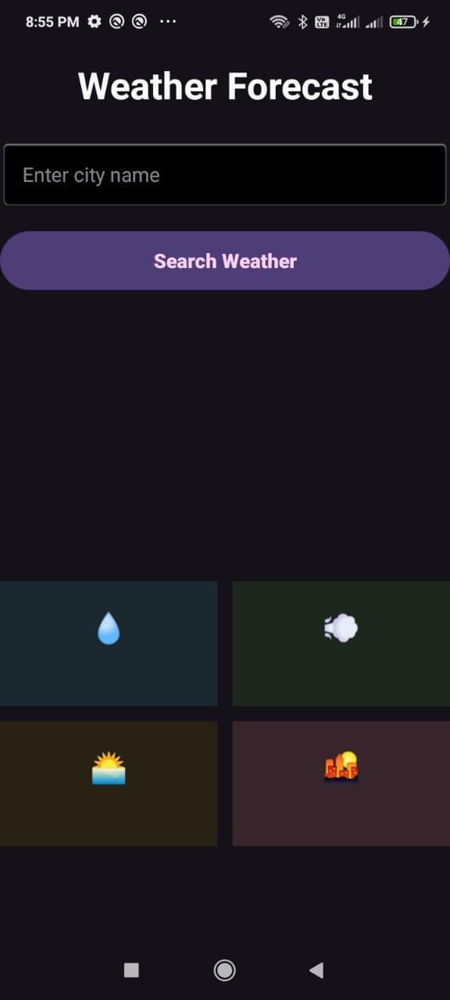
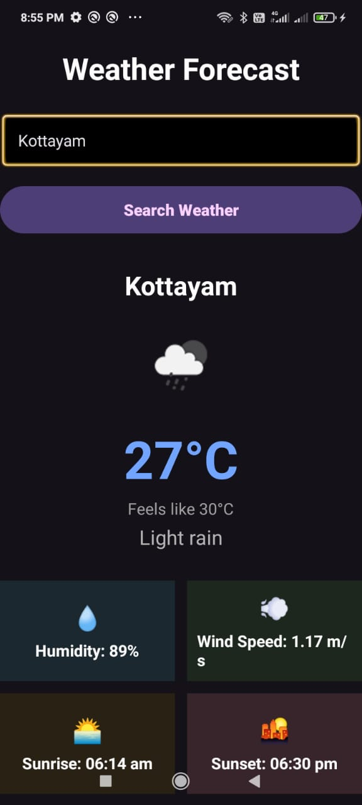
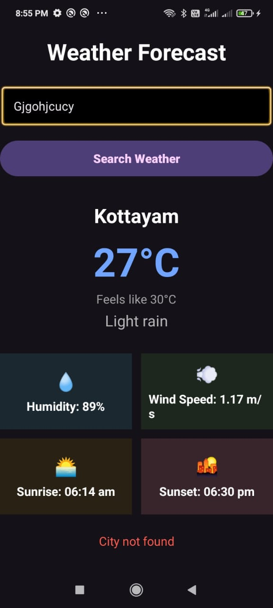
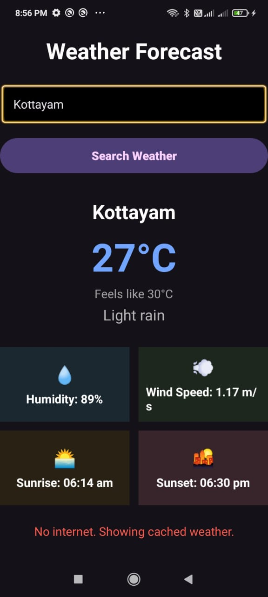

# Weather Forecast App 🌤️

A simple and user-friendly Android Weather Forecast application developed as part of my Android App Development Internship at Syntecxhub.

## 📱 Features

* Search weather by city name
* Current temperature in Celsius
* Feels-like temperature
* Weather condition and description
* Weather condition icon
* Humidity information
* Wind speed
* Sunrise and sunset time
* Loading indicator
* City not found error handling
* Invalid API key error handling
* Network error handling
* Offline weather data using Room Database cache
* Responsive user interface

## 🛠️ Technologies Used

* Kotlin
* XML
* Android Studio
* OpenWeatherMap API
* Retrofit
* Gson
* Kotlin Coroutines
* ViewModel
* Coil
* Room Database

## 🏗️ Architecture

```text
MainActivity
     ↓
  ViewModel
     ↓
 Repository
   ↙     ↘
Retrofit   Room Database
   ↓
OpenWeatherMap API
```

## 🔐 API Key Security

The OpenWeatherMap API key is stored securely in `local.properties` and is not included in this GitHub repository.

## 📸 Screenshots

### Main Screen



### Weather Result



### City Not Found



### Cached Weather



## 📦 APK Download

The APK is available through the GitHub Releases section.

👉 [View Releases and Download APK](https://github.com/Alby2442/Syntecxhub_Weather_Forecast_App/releases)

Open the latest release and download `app-debug.apk` from the **Assets** section.

## 🎓 Internship

This project was developed as part of my Android App Development Internship at Syntecxhub.

## 👨‍💻 Developer

**Albin Saji**

BCA – Computer Applications

## 📄 Project Information

| Information | Details                                       |
| ----------- | --------------------------------------------- |
| Project     | Weather Forecast App                          |
| Version     | 1.0.0                                         |
| Platform    | Android                                       |
| Language    | Kotlin                                        |
| UI          | XML                                           |
| API         | OpenWeatherMap                                |
| Internship  | Syntecxhub Android App Development Internship |


